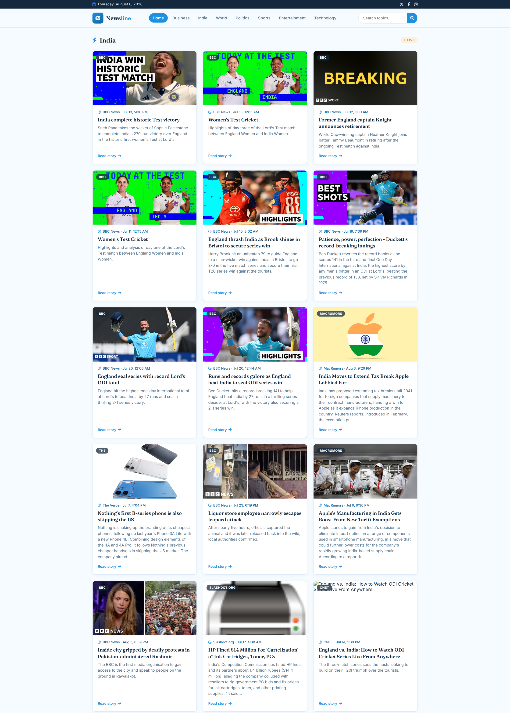

# 📰 News Website

A responsive News Website built using **HTML, CSS, and JavaScript** that fetches real-time news from a News API. Users can browse the latest headlines, search for news by keyword, and enjoy a clean, modern interface.

## 🚀 Features

- 📰 Latest news headlines
- 🔍 Search news by keyword
- 📱 Fully responsive design
- ⚡ Real-time news using API
- 🎨 Clean and modern UI
- 📂 Category-based news browsing
- 🔄 Dynamic content loading
- ⭐ Font Awesome icons

## 🛠️ Technologies Used

- HTML5
- CSS3
- JavaScript (ES6)
- News API
- Fetch API
- Font Awesome

## 📷 Screenshots

## 🎯 Future Improvements

- Dark Mode
- Bookmark articles
- Pagination
- Multiple news categories
- Better search filtering
- Country-wise news

## 👩‍💻 Author

**Janvi Chauhan**

---

⭐ If you like this project, consider giving it a star!
