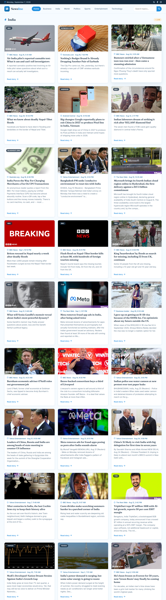

# 📰 News Website

A modern and responsive **News Website** built using HTML, CSS, and JavaScript. The project provides a clean interface for browsing news articles across different categories.

## 🚀 preview

🔗 

## ✨ Features

* 📱 **Fully Responsive Design** — Optimized for desktop, tablet, and mobile devices
* 📰 **News Cards** — Displays news articles with images, headlines, and descriptions
* 🗂️ **News Categories** — Browse news by different categories
* 🔥 **Featured/Trending News** — Highlights important and popular stories
* 🔍 **Search Functionality** — Search for specific news and topics
* 🧭 **Responsive Navigation Bar** — Easy navigation between different sections
* ⚡ **Interactive UI** — JavaScript-powered interactions and dynamic content
* 🎨 **Clean & Modern Interface** — Simple layout designed for comfortable reading
* 📱 **Mobile-Friendly Layout** — Adapts content and navigation to smaller screens

## 🛠️ Technologies Used

* **HTML5** — Structure and semantic markup
* **CSS3** — Styling, layouts, animations, and responsiveness
* **JavaScript** — Interactivity and dynamic functionality

## 🎯 What I Practiced

This project helped me practice:

* Responsive web design
* CSS Flexbox and Grid
* JavaScript DOM manipulation
* Event handling
* Creating responsive navigation
* Organizing content into categories
* Creating modern website layouts
* Connect to a real News API

## 🔮 Future Improvements

* Add user authentication
* Add bookmarks/saved articles
* Add dark mode
* Add pagination or infinite scrolling
* Add detailed article pages
* Add personalized news recommendations

## 👩‍💻 Author

**Janvi Chauhan**

GitHub: [@mjanvichauhan-cell](https://github.com/mjanvichauhan-cell)

## ⭐ Support

If you like this project, consider giving the repository a ⭐.
